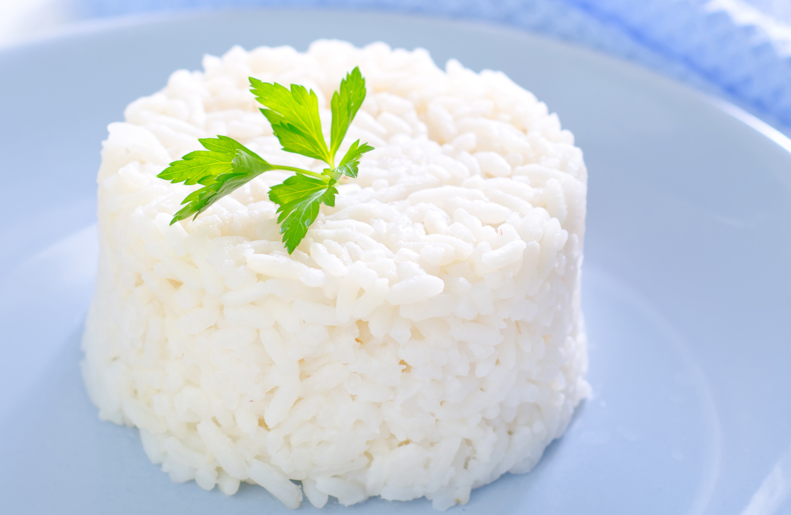

# How to Cook White Rice
 _By Linda Schnabel_

Cooking rice seems straightforward, but can be intimidating for those new to cooking.

People argue on whether or not you should wash your rice, what should the water to rice ratio be, how to season it and more. Most of these decisions come down to cultural backgrounds and the purpose rice serves in the meal.

My recipe is based on [this recipe](https://loisa.com/blogs/comida-real/arroz-blanco?srsltid=AfmBOorr41UHREN_ix6dn2EvPc6UEkVFEU6OYAC0vF9DTuvDkVTK2zpf) with some modifications I've made over time as I've gained experience. I hope this serves as a starting point for your own white rice recipe.

## Ingredients
- 3 cups of water
- 1 and 1/2 cups of white rice
- 1 tablespoon of olive oil
- 1 tablespoon of Adobo (to taste)
- 1 teaspoon of garlic powder

## Directions
1. Set the stove to medium heat and place a medium-sized pot on the stove.
2. Heat the olive oil in the pot to a medium heat.
3. Add the garlic powder and mix it with the olive oil.
4. Pour the rice into the pot. Stir the rice with a ladle so it is evenly covered by the olive oil.
5. Pour the water into the pot and increase the heat to medium-high.
6. Add the adobo to the pot and stir for 20 seconds. 
7. Cover the pot for the water to boil faster.
8. Once the water is bubbling, stir the rice and cover it again.
9. Set the heat to low and keep the pot covered for 10 minutes.
10. Uncover the pot to check on the rice. You will notice the water is gone but the rice will still look wet.
11. Use the ladel to redistribute the rice from the bottom of the pot to the top and stir for 10 seconds. This will ensure the rice cooks evenly.
12. Cover the pot and let the rice cook for another ten minutes.
13. Serve the rice and put away any leftovers in the fridge to prevent spoilage.  

I hope this helps you on your culinary journey!
